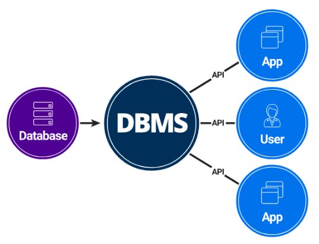
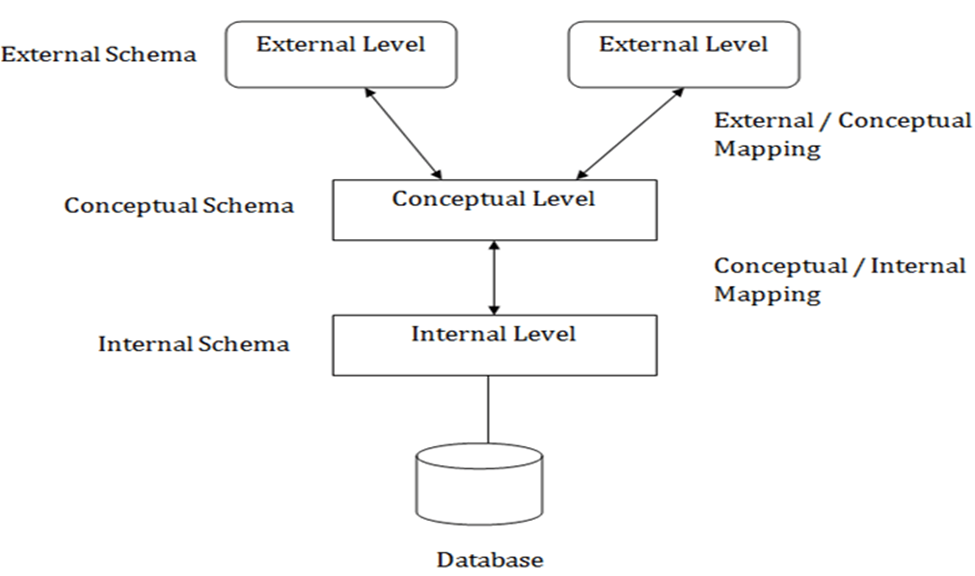

# DBMS Notes

---

## Introduction to DBMS

### 1. What is Data?
Data is a collection of raw, unorganized facts (text, numbers, symbols, etc.) with no inherent meaning until processed.

- Measured in bits and bytes (basic units of computer storage).
- Can be recorded but is meaningless without processing.

### 2. Types of Data
**Quantitative Data:** Numerical (e.g., weight, volume, cost).

**Qualitative Data:** Descriptive, non-numerical (e.g., name, gender, hair color).

### 3. What is Information?
Information is processed, organized, and structured data that provides context and enables decision-making.

**Example:**
- Data: List of people in a locality.
- Information: After analysis, you find 100 senior citizens, sex ratio 1.1, 100 newborns.

### 4. Data vs Information
| Data                | Information                |
|---------------------|----------------------------|
| Raw, unorganized    | Processed, organized       |
| No context          | Contextual, meaningful     |
| Not useful directly | Useful for decision-making |

**Key Points:**
- Data is meaningless until analyzed.
- Information depends on data, not vice versa.
- Data: numbers, stats, graphs. Information: words, ideas, context.

### 5. What is a Database?
A database is an electronic system for storing data so it can be easily accessed, managed, and updated.

### 6. What is a DBMS?
A Database Management System (DBMS) is software for storing, retrieving, and managing data in databases.

- Contains both the database and the software to add, access, update, and delete data.
- Main goal: convenient and efficient data management.

**Diagram:**

### 7. DBMS vs File Systems
DBMS addresses the limitations of traditional file systems:

- Data redundancy & inconsistency
- Difficulty accessing data
- Data isolation
- Integrity problems
- Atomicity problems
- Concurrent-access anomalies
- Security problems

---

## DBMS Architecture

### 1. View of Data (Three Schema Architecture)
- The main purpose of a DBMS is to provide users with an abstract view of the data.
- The system hides details of how data is stored and maintained.
- Abstraction is applied through several levels to simplify user interaction.
- Multiple users can access the same data with personalized views, while the data is stored only once.
- This is achieved using three levels of abstraction:

#### a. Physical level / Internal level
This is the lowest level of abstraction and describes how the data is actually stored.

- Utilizes low-level data structures.
- Has a Physical Schema, which describes the physical storage structure of the database.
- Deals with storage allocation, data compression, and encryption.
- The goal is to define algorithms that allow for efficient access to data.

#### b. Logical level / Conceptual level
This level describes what data is stored in the database and the relationships that exist among that data.

- The Conceptual Schema describes the database's design at the conceptual level.
- A user at the logical level doesn't need to be aware of the physical-level structures.
- Database Administrators (DBAs), who decide what information to keep in the database, use this level of abstraction.
- Its goal is to be easy to use.

#### c. View level / External level
This is the highest level of abstraction, aiming to simplify user interaction by providing different views to different end-users.

- Each External Schema (also called a subschema) describes the part of the database that a particular user group is interested in, hiding the rest.
- A database can have several external schemas.
- Views also provide a security mechanism to prevent users from accessing certain parts of the database.

**Diagram:**

### 2. Instances and Schemas
An instance of a database is the collection of information stored in it at a particular moment.

The schema is the overall design of the database. It is the structural description of the data and doesn't change frequently, while the data in the instance may change often.

- A database schema is analogous to variable declarations in a program.
- There are three types of schemas: Physical, Logical, and several view schemas (subschemas).
- The Logical Schema is the most important in its effect on application programs, as programmers build apps using it.
- Physical data independence means that changes to the physical schema should not affect the logical schema or application programs.

### 3. Data Models
A Data Model is a collection of conceptual tools for describing data, relationships, semantics, and consistency constraints.

It provides a way to describe the design of a database at the logical level.

Examples include the Entity-Relationship (ER) model, Relational Model, and object-oriented model.

### 4. Database Languages

**Data Definition Language (DDL)** is used to specify the database schema. It is also used to define consistency constraints that are checked every time the database is updated.

**Data Manipulation Language (DML)** is used to express database queries and updates. Data manipulation involves:
- Retrieval of information.
- Insertion of new information.
- Deletion of information.
- Updating existing information.

A query language is the part of DML used for information retrieval.

In practice, DDL and DML features are present in a single database language, such as SQL.

### 5. How is a Database Accessed from Application Programs?
Applications (written in host languages like C/C++, Java) interact with the database.

For example, a banking system's payroll module accesses the database by executing DML statements from the C host language.

An API is provided to send DML/DDL statements to the database and retrieve results. Examples include:
- Open Database Connectivity (ODBC) for "C".
- Java Database Connectivity (JDBC) for Java.

### 6. Database Administrator (DBA)
A DBA is a person with central control of both the data and the programs that access it.

Functions of a DBA include:
- Schema Definition.
- Defining storage structure and access methods.
- Schema and physical organization modifications.
- Authorization control.
- Routine maintenance, such as periodic backups, applying security patches, and handling upgrades.

### 7. DBMS Application Architectures
These architectures describe the relationship between client machines (where users work) and server machines (where the database runs).

**T1 (One-Tier) Architecture:** The client, server, and database are all present on the same machine.

**T2 (Two-Tier) Architecture:**
- The application is partitioned into two components: a client and a server.
- The client machine invokes database system functionality on the server using query language statements.
- API standards like ODBC and JDBC are used for interaction.

**T3 (Three-Tier) Architecture:**
- The application is partitioned into three logical components: client, application server, and database server.
- The client is just a front end and doesn't contain any direct database calls.
- The client communicates with an application server, and the application server communicates with the database system to access data.
- Business logic resides in the application server.
- This architecture is best for World Wide Web applications.

**Advantages:**
- Scalability due to distributed application servers.
- Data Integrity, as the app server acts as a middle layer that can minimize data corruption.
- Security, because the client cannot directly access the database.

### 6. Database Administrator (DBA)
- Central control of data and access programs.
- Functions:
	- Schema definition
	- Storage/access method definition
	- Modifications
	- Authorization control
	- Routine maintenance (backups, security patches, upgrades)

### 7. DBMS Application Architectures
Describes client-server relationships:

- **One-Tier (T1):** Client, server, and database on same machine.
- **Two-Tier (T2):** Client and server are separate; client uses APIs (ODBC/JDBC) to interact with server.
- **Three-Tier (T3):**
	- Client (front end, no direct DB calls)
	- Application server (business logic)
	- Database server
	- Best for web apps; improves scalability, integrity, and security.

**Diagram:**

