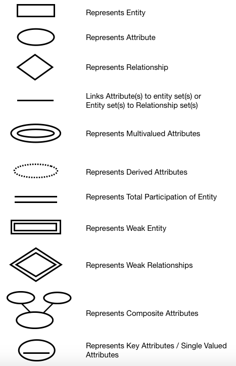
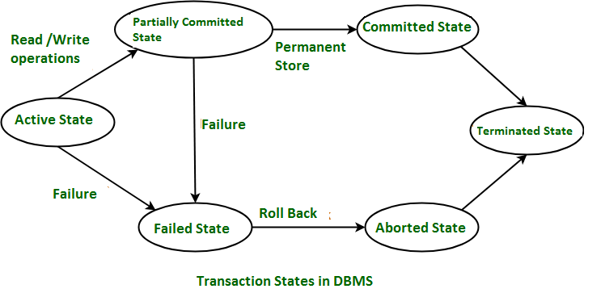

# DBMS Notes

## Table of Contents

1. [Introduction to DBMS](#1-introduction-to-dbms)
2. [DBMS Architecture](#2-dbms-architecture)
3. [Entity-Relationship Model](#3-entity-relationship-model)
4. [Extended ER Features](#4-extended-er-features)
5. [Relational Model](#5-relational-model)
6. [Mapping the ER Model to the Relational Model](#6-mapping-the-er-model-to-the-relational-model)
7. [Core SQL Concepts](#7-core-sql-concepts)
8. [Normalisation](#8-normalisation)
9. [Transactions](#9-transactions)
10. [Implementing Atomicity and Durability](#10-implementing-atomicity-and-durability)
11. [Indexing in DBMS](#11-indexing-in-dbms)
12. [NoSQL](#12-nosql)
13. [Types of Databases](#13-types-of-databases)
14. [Clustering in DBMS](#14-clustering-in-dbms)
15. [Partitioning & Sharding in DBMS (DB Optimization)](#15-partitioning--sharding-in-dbms-db-optimization)

---

## 1. Introduction to DBMS

### 1. What is Data?
Data is a collection of raw, unorganized facts (text, numbers, symbols, etc.) with no inherent meaning until processed.

- Measured in bits and bytes (basic units of computer storage).
- Can be recorded but is meaningless without processing.

### 2. Types of Data
**Quantitative Data:** Numerical (e.g., weight, volume, cost).

**Qualitative Data:** Descriptive, non-numerical (e.g., name, gender, hair color).

### 3. What is Information?
Information is processed, organized, and structured data that provides context and enables decision-making.

**Example:**
- Data: List of people in a locality.
- Information: After analysis, you find 100 senior citizens, sex ratio 1.1, 100 newborns.

### 4. Data vs Information
| Data                | Information                |
|---------------------|----------------------------|
| Raw, unorganized    | Processed, organized       |
| No context          | Contextual, meaningful     |
| Not useful directly | Useful for decision-making |

**Key Points:**
- Data is meaningless until analyzed.
- Information depends on data, not vice versa.
- Data: numbers, stats, graphs. Information: words, ideas, context.

### 5. What is a Database?
A database is an electronic system for storing data so it can be easily accessed, managed, and updated.

### 6. What is a DBMS?
A Database Management System (DBMS) is software for storing, retrieving, and managing data in databases.

- Contains both the database and the software to add, access, update, and delete data.
- Main goal: convenient and efficient data management.

**Diagram:**

### 7. DBMS vs File Systems
DBMS addresses the limitations of traditional file systems:

- Data redundancy & inconsistency
- Difficulty accessing data
- Data isolation
- Integrity problems
- Atomicity problems
- Concurrent-access anomalies
- Security problems

---

## 2. DBMS Architecture

### 1. View of Data (Three Schema Architecture)
- The main purpose of a DBMS is to provide users with an abstract view of the data.
- The system hides details of how data is stored and maintained.
- Abstraction is applied through several levels to simplify user interaction.
- Multiple users can access the same data with personalized views, while the data is stored only once.
- This is achieved using three levels of abstraction:

#### a. Physical level / Internal level
This is the lowest level of abstraction and describes how the data is actually stored.

- Utilizes low-level data structures.
- Has a Physical Schema, which describes the physical storage structure of the database.
- Deals with storage allocation, data compression, and encryption.
- The goal is to define algorithms that allow for efficient access to data.

#### b. Logical level / Conceptual level
This level describes what data is stored in the database and the relationships that exist among that data.

- The Conceptual Schema describes the database's design at the conceptual level.
- A user at the logical level doesn't need to be aware of the physical-level structures.
- Database Administrators (DBAs), who decide what information to keep in the database, use this level of abstraction.
- Its goal is to be easy to use.

#### c. View level / External level
This is the highest level of abstraction, aiming to simplify user interaction by providing different views to different end-users.

- Each External Schema (also called a subschema) describes the part of the database that a particular user group is interested in, hiding the rest.
- A database can have several external schemas.
- Views also provide a security mechanism to prevent users from accessing certain parts of the database.

**Diagram:**

### 2. Instances and Schemas
An instance of a database is the collection of information stored in it at a particular moment.

The schema is the overall design of the database. It is the structural description of the data and doesn't change frequently, while the data in the instance may change often.

- A database schema is analogous to variable declarations in a program.
- There are three types of schemas: Physical, Logical, and several view schemas (subschemas).
- The Logical Schema is the most important in its effect on application programs, as programmers build apps using it.
- Physical data independence means that changes to the physical schema should not affect the logical schema or application programs.

### 3. Data Models
A Data Model is a collection of conceptual tools for describing data, relationships, semantics, and consistency constraints.

It provides a way to describe the design of a database at the logical level.

Examples include the Entity-Relationship (ER) model, Relational Model, and object-oriented model.

### 4. Database Languages

**Data Definition Language (DDL)** is used to specify the database schema. It is also used to define consistency constraints that are checked every time the database is updated.

**Data Manipulation Language (DML)** is used to express database queries and updates. Data manipulation involves:
- Retrieval of information.
- Insertion of new information.
- Deletion of information.
- Updating existing information.

A query language is the part of DML used for information retrieval.

In practice, DDL and DML features are present in a single database language, such as SQL.

### 5. How is a Database Accessed from Application Programs?
Applications (written in host languages like C/C++, Java) interact with the database.

For example, a banking system's payroll module accesses the database by executing DML statements from the C host language.

An API is provided to send DML/DDL statements to the database and retrieve results. Examples include:
- Open Database Connectivity (ODBC) for "C".
- Java Database Connectivity (JDBC) for Java.

### 6. Database Administrator (DBA)
A DBA is a person with central control of both the data and the programs that access it.

Functions of a DBA include:
- Schema Definition.
- Defining storage structure and access methods.
- Schema and physical organization modifications.
- Authorization control.
- Routine maintenance, such as periodic backups, applying security patches, and handling upgrades.

### 7. DBMS Application Architectures
These architectures describe the relationship between client machines (where users work) and server machines (where the database runs).

**T1 (One-Tier) Architecture:** The client, server, and database are all present on the same machine.

**T2 (Two-Tier) Architecture:**
- The application is partitioned into two components: a client and a server.
- The client machine invokes database system functionality on the server using query language statements.
- API standards like ODBC and JDBC are used for interaction.

**T3 (Three-Tier) Architecture:**
- The application is partitioned into three logical components: client, application server, and database server.
- The client is just a front end and doesn't contain any direct database calls.
- The client communicates with an application server, and the application server communicates with the database system to access data.
- Business logic resides in the application server.
- This architecture is best for World Wide Web applications.

**Advantages:**
- Scalability due to distributed application servers.
- Data Integrity, as the app server acts as a middle layer that can minimize data corruption.
- Security, because the client cannot directly access the database.

### 6. Database Administrator (DBA)
- Central control of data and access programs.
- Functions:
	- Schema definition
	- Storage/access method definition
	- Modifications
	- Authorization control
	- Routine maintenance (backups, security patches, upgrades)

### 7. DBMS Application Architectures
Describes client-server relationships:

- **One-Tier (T1):** Client, server, and database on same machine.
- **Two-Tier (T2):** Client and server are separate; client uses APIs (ODBC/JDBC) to interact with server.
- **Three-Tier (T3):**
	- Client (front end, no direct DB calls)
	- Application server (business logic)
	- Database server
	- Best for web apps; improves scalability, integrity, and security.

**Diagram:**

---

## 3: Entity-Relationship Model

A Data Model is a collection of conceptual tools for describing data, data relationships, data semantics, and consistency constraints.

### 1. ER Model
The Entity-Relationship (ER) Model is a high-level data model based on a perception of the real world, which consists of a collection of basic objects called entities and the relationships among these objects.

The graphical representation of the ER Model is the ER diagram, which acts as a blueprint for the database.

### 2. Entity
- An Entity is a "thing" or "object" in the real world that is distinguishable from all other objects.
- It has a physical existence. For example, each student in a college is an entity.
- An entity can be uniquely identified, usually by a primary attribute known as a Primary Key.
- **Strong Entity:** An entity that can be uniquely identified on its own.
- **Weak Entity:** An entity that cannot be uniquely identified by its own attributes and depends on a strong entity for its existence.
    - It doesn't have sufficient attributes to form a primary key.
    - For example, a Loan is a strong entity, but a Payment is weak, as its installment numbers are only unique for each specific loan.
    - A weak entity depends on a strong entity for its existence.

### 3. Entity Set
An entity set is a group of entities of the same type that share the same properties or attributes.

For example, Student is an entity set, and Customer of a bank is another.

### 4. Attributes
- An entity is represented by a set of attributes.
- Each entity has a value for each of its attributes.
- For each attribute, there is a set of permitted values called the domain.
- For example, a Student entity has attributes like Student ID, Name, Address, etc.

#### Types of Attributes
- **Simple:** Attributes that cannot be divided further.
- **Composite:** Attributes that can be divided into subparts (e.g., Name can be divided into first-name, middle-name, last-name).
- **Single-valued:** Attributes that can only have one value (e.g., Student ID).
- **Multi-valued:** Attributes that can have more than one value (e.g., phone-number, dependent-name).
- **Derived:** An attribute whose value can be calculated from other related attributes (e.g., Age can be derived from a date of birth).
- **NULL Value:** Used when an entity does not have a value for an attribute. It can mean "not applicable" (like a person with no middle name) or "unknown" (the value is missing or not yet known).

### 5. Relationships
- A relationship is an association among two or more entities. For example, a Customer borrows a Loan.
- **Strong Relationship:** A relationship between two independent (strong) entities.
- **Weak Relationship:** A relationship between a weak entity and its owner strong entity.
- **Degree of Relationship:** The number of entity sets participating in a relationship.
    - **Unary:** One entity set participates (e.g., an Employee manages an Employee).
    - **Binary:** Two entity sets participate (e.g., a Student takes a Course). This is the most common type.
    - **Ternary:** Three entity sets participate (e.g., an Employee works-on a job at a branch).

### 6. Relationship Constraints
#### a. Mapping Cardinality / Cardinality Ratio:
Defines the number of entities in one set that can be associated with entities in another set.

- **One-to-One (1:1):** An entity in A is associated with at most one entity in B, and vice versa (e.g., Citizen has Aadhar Card).
- **One-to-Many (1:N):** An entity in A is associated with many entities in B, but an entity in B is associated with at most one entity in A (e.g., Citizen has Vehicle).
- **Many-to-One (N:1):** An entity in A is associated with at most one entity in B, but an entity in B can be associated with many in A (e.g., Course taken by Professor).
- **Many-to-Many (N:M):** An entity in A can be associated with many entities in B, and vice versa (e.g., Student attends Course).

#### b. Participation Constraints:
Also known as the minimum cardinality constraint, this specifies whether the existence of an entity depends on its being related to another entity.

- **Total Participation:** Every entity in the entity set must participate in at least one relationship (e.g., a Loan must have a Customer). Weak entities always have total participation.
- **Partial Participation:** Not every entity in the set needs to participate in the relationship (e.g., not every Customer has a Loan).

### 7. ER Notations

---

## 4: Extended ER Features

While basic ER features can model most database requirements, it's better to use extended features when the complexity of the database schema increases.

### 1. Specialisation
This is the process of splitting an entity set into sub-entity sets based on their specific functionalities or features. 

- It is a top-down approach. 
- Example: A Person entity set (the superclass) can be divided into specialized subclasses like customer, student, and employee. 
- An "is-a" relationship exists between a superclass and its subclasses, which is depicted by a triangle component in an ER diagram. 

**Why use Specialisation?**
- Certain attributes may only be applicable to a few entities of the parent entity set. 
- It allows a designer to show the distinctive features of the sub-entities. 
- It helps to group entities to refine the overall database blueprint. 

### 2. Generalisation
This is the reverse of Specialisation; it is a bottom-up approach. 

- It is used when a designer finds that different entity sets have overlapping properties. The designer can create a new, generalized entity set (a superclass) to hold the common attributes. 
- Example: Car, Jeep, and Bus have common attributes. To avoid data repetition, a designer can generalize them into a new entity set called Vehicle. 
- An "is-a" relationship is also present between the subclass and the superclass. 

**Why use Generalisation?**
- It makes the database more refined and simpler. 
- It prevents common attributes from being repeated. 

### 3. Attribute Inheritance
In both Specialisation and Generalisation, the attributes of the higher-level entity sets (superclasses) are inherited by the lower-level entity sets (subclasses). 

Example: Customer and Employee inherit the attributes of Person. 

### 4. Participation Inheritance
If a parent entity set participates in a relationship, then its child entity sets also participate in that same relationship. 

### 5. Aggregation
Aggregation is a technique used to show relationships among relationships. 

- It is an abstraction where relationships are treated as higher-level entities. 
- This technique helps avoid redundancy by aggregating a relationship into an entity set itself. 

---

## 5: Relational Model

### 1. The Relational Model
The Relational Model (RM) is a way of organizing data into tables, which are also known as relations. A relational database is a collection of these uniquely named tables.

- **Tuple:** A single row in a table, representing a unique record or data point.
- **Columns/Attributes:** Represents the properties of the relation. Each attribute has a set of permitted values called a domain.
- **Relation Schema:** Defines the design and structure of a table, including its name and all its columns.
- **Degree:** The total number of columns/attributes in a table.
- **Cardinality:** The total number of rows/tuples in a table.

Common Relational Database Management Systems (RDBMS) include Oracle, IBM, MySQL, and MS Access.

### 2. Important Properties of a Table
- The name of a table must be distinct from all other tables.
- The values in each cell of a table must be atomic (indivisible).
- The name of each column must be unique within that table.
- Each row (tuple) in the table must be unique.
- The order of rows and columns has no significance.
- Tables must follow integrity constraints to maintain data consistency.

### 3. Relational Model Keys
A Relational Key is a set of one or more attributes that can uniquely identify a tuple within a table.

- **Super Key (SK):** Any set of attributes that can uniquely identify each tuple in a table.
- **Candidate Key (CK):** A minimal super key, meaning it has no redundant attributes. Its value cannot be NULL.
- **Primary Key (PK):** The one candidate key that is chosen to be the main identifier for the table.
- **Alternate Key (AK):** All candidate keys that were not chosen as the primary key.
- **Foreign Key (FK):** An attribute in one table that references the primary key of another table. It's used to create a relationship and cross-reference data between the two tables. The table with the FK is the referencing (child) table, and the table with the PK is the referenced (parent) table.
- **Composite Key:** A primary key that consists of two or more attributes working together.
- **Compound Key:** A primary key that is formed using two or more foreign keys.
- **Surrogate Key:** A system-generated, artificial key (usually an integer) used as a primary key.

### 4. Integrity Constraints
These are rules applied during data operations to prevent accidental corruption of the database and ensure consistency.

- **Domain Constraints:** Restricts the values of an attribute to a specific data type or range. For example, you could constrain a birth_year column to values less than 2002.
- **Entity Integrity Constraint:** States that every table must have a primary key, and that key cannot be NULL.
- **Referential Integrity Constraint:** Ensures consistency between related tables. It requires that every value of a Foreign Key must either be NULL or must exist as a Primary Key value in the referenced (parent) table.
- **Key Constraints:**
  - **NOT NULL:** Ensures a column cannot have a NULL value.
  - **UNIQUE:** Ensures all values in a column are different from one another.
  - **DEFAULT:** Provides a default value for a column when none is specified.
  - **CHECK:** An integrity constraint that verifies data before and after any data modification.
  - **PRIMARY KEY:** The attribute(s) that uniquely identify each record. It must be both unique and not null.
  - **FOREIGN KEY:** The attribute that links two tables together. It prevents actions that would break the link between tables.
---

## 6: Mapping the ER Model to the Relational Model

### Introduction
Both the ER Model and the Relational Model are abstract, logical ways to represent a real-world enterprise. Because they share similar design principles, an ER diagram can be converted into a relational database design by translating its components into a set of tables.

### Mapping Rules

#### 1. Strong Entity Set
- A strong entity set becomes its own table.
- The entity's attributes become the columns of the table.
- The entity's Primary Key (PK) becomes the table's PK.

#### 2. Weak Entity Set
- A separate table is created for the weak entity set with all of its attributes.
- The Primary Key of the strong entity it depends on is added as a Foreign Key (FK) to this table.
- The Primary Key of this table is a composite key, formed by combining the FK from the strong entity and the weak entity's partial discriminator key.

#### 3. Single-Valued & Composite Attributes
- Single-valued attributes are mapped directly to columns in the table.
- For composite attributes, a separate column is created for each component part, and the original composite attribute itself is ignored.
  - For example, for a composite Address attribute with components {street, city, state}, the table would have columns street, city, and state, not an Address column.

#### 4. Multivalued Attributes
- A new, separate table is created for each multivalued attribute.
- This new table contains the PK of the original entity (as a FK) and a column for the multivalued attribute itself.
- The PK of this new table is a composite key made from both of its columns.

#### 5. Derived Attributes
- Derived attributes are generally not included in the tables, as they can be calculated.

#### 6. Generalisation / Specialisation
There are two common methods for mapping this structure:

**Method 1: Table for Every Entity Set**
- Create a table for the higher-level (superclass) entity.
- For each lower-level (subclass) entity, create a separate table that includes only the subclass's specific attributes plus the PK from the superclass table (which acts as a FK).

**Method 2: Tables for Subclasses Only**
- This method is only used if the subclasses are disjoint (no overlap) and complete (cover all possibilities).
- Do not create a table for the superclass.
- For each subclass, create a table that includes both its own specific attributes and all the attributes from the superclass.

**Drawback:** This method can lead to redundant data if the generalisation is overlapping, or it may be unable to represent entities that don't fit into a subclass if the generalisation is not complete.

#### 7. Aggregation
- A table is created for the aggregated relationship.
- This table's attributes include the PKs of the entities involved in the aggregation.
- Any attributes of the relationship itself are also added as columns.

---

## 7: Core SQL Concepts

### 1. What is SQL?
SQL (Structured Query Language) is the standard language for accessing and manipulating data in relational databases.

- It is based on CRUD (CREATE, READ, UPDATE, DELETE) operations, which form the basis of data interaction.
- An RDBMS (Relational Database Management System) is the software that manages the database (e.g., MySQL, Oracle). SQL is the language used to communicate with the RDBMS.

### 2. SQL Data Types
SQL requires data to be categorized by type. Each column in a database table is assigned a data type that dictates what kind of data it can hold. Common categories include:

- **String Types:** For text data (e.g., CHAR, VARCHAR, TEXT).
- **Numeric Types:** For numbers (e.g., INT, FLOAT, DECIMAL).
- **Date and Time Types:** For temporal data (e.g., DATE, DATETIME, TIMESTAMP).

### 3. Types of SQL Commands
SQL commands are grouped into categories based on their function:

- **DDL (Data Definition Language):** Used to define and manage the structure of the database, such as tables and schemas (e.g., CREATE, ALTER, DROP).
- **DQL (Data Query Language):** Used to retrieve data from the database (e.g., SELECT).
- **DML (Data Manipulation Language):** Used to modify the data itself (e.g., INSERT, UPDATE, DELETE).
- **DCL (Data Control Language):** Used to manage user permissions and access control (e.g., GRANT, REVOKE).
- **TCL (Transaction Control Language):** Used to manage transactions and ensure data integrity (e.g., COMMIT, ROLLBACK).

### 4. Data Retrieval Concepts
The core of querying is retrieving specific data. This is achieved through several key concepts:

- **Filtering:** Using conditions to reduce the number of rows returned from a table (the concept behind the WHERE clause).
- **Sorting:** Ordering the retrieved data in an ascending or descending manner based on one or more columns (the concept behind the ORDER BY clause).
- **Grouping & Aggregation:** Collecting data from multiple records and grouping the result by one or more columns. This is typically used with aggregate functions like COUNT(), SUM(), or AVG() to perform calculations on each group (the concept behind the GROUP BY clause).
- **Filtering Groups:** Applying conditions to filter the aggregated groups created by the grouping process (the concept behind the HAVING clause).

### 5. Database Constraints
Constraints are rules that are enforced on data columns to ensure the accuracy, reliability, and integrity of the data in the database.

- **PRIMARY KEY:** A constraint that uniquely identifies each record in a table. It cannot contain NULL values.
- **FOREIGN KEY:** A key that links two tables together, enforcing referential integrity.
- **UNIQUE:** Ensures that all values in a column are different from each other.
- **CHECK:** A constraint that limits the value range that can be placed in a column.
- **DEFAULT:** Provides a default value for a column when no value is specified.

### 6. The Concept of Joining Tables
Joins are a fundamental concept in relational databases. They are used to combine rows from two or more tables based on a related column between them, allowing for the retrieval of a unified, meaningful dataset.

- **Inner Join:** Returns only the records that have matching values in both tables.
- **Left Join:** Returns all records from the left table and the matched records from the right table.
- **Right Join:** Returns all records from the right table and the matched records from the left table.

### 7. Advanced Concepts: Subqueries and Views
- **Subquery:** A query that is nested inside another query. The outer query uses the result of the inner query to determine its own result. They are an alternative to joins for solving complex problems.
- **View:** A virtual table based on the result-set of an SQL statement. It contains rows and columns like a real table but doesn't store the data itself. Views can simplify complex queries and provide a layer of security by restricting data access.

---

## 8: Normalisation

### 1. What is Normalisation?
Normalisation is a database optimization technique used to minimize data redundancy from a relation. It is also used to eliminate undesirable characteristics like Insertion, Update, and Deletion Anomalies. The process works by dividing larger tables into smaller and more manageable tables, linking them together using relationships. The use of normal forms helps to reduce redundancy from the database table.

### 2. Functional Dependency (FD)
A Functional Dependency (FD) is a relationship between attributes in a relation, usually between the primary key and other attributes.

- It is represented as X -> Y, where the left side (X) is the Determinant, and the right side (Y) is the Dependent.

#### Types of FD
- **Trivial FD:** A functional dependency A -> B is trivial if B is a subset of A. For example, {StudentID, Name} -> {Name} is trivial.
- **Non-trivial FD:** A functional dependency A -> B is non-trivial if B is not a subset of A.

#### Armstrong's Axioms (Rules of FD)
These are the fundamental rules governing functional dependencies:

- **Reflexive Rule:** If 'A' is a set of attributes and 'B' is a subset of 'A', then A -> B holds.
- **Augmentation Rule:** If A -> B holds, then adding any attribute 'X' to both sides will also hold: AX -> BX.
- **Transitivity Rule:** If A -> B holds and B -> C holds, then A -> C also holds.

### 3. The Problem: Data Redundancy and Anomalies
The primary reason for normalisation is to avoid data redundancy in the database. When a database has redundant data, it leads to three types of anomalies, which are abnormalities in the data:

- **Insertion Anomaly:** Occurs when certain data cannot be inserted into the database without the presence of other data.
- **Deletion Anomaly:** Refers to the situation where deleting one piece of data results in the unintended loss of other important data.
- **Updation Anomaly:** Happens when updating a single data value requires multiple rows to be updated. This can lead to data inconsistency if an update is missed in one of the locations.

These anomalies increase the database size and can cause its performance to become very slow.

### 4. The Solution: Normal Forms
Normalisation is achieved by following a set of rules called normal forms.

#### First Normal Form (1NF)
- Every cell in the relation must have an atomic (single) value.
- The relation must not contain any multi-valued attributes.

#### Second Normal Form (2NF)
- The relation must be in 1NF.
- There should be no partial dependency. This means all non-prime attributes must be fully dependent on the entire primary key, not just a part of it.

#### Third Normal Form (3NF)
- The relation must be in 2NF.
- There must be no transitive dependency. This means a non-prime attribute should not depend on another non-prime attribute.

#### Boyce-Codd Normal Form (BCNF)
- The relation must be in 3NF.
- For every functional dependency A -> B, the determinant A must be a super key. This implies that a prime attribute cannot be derived from any non-prime attribute.

### 5. Advantages of Normalisation
- Helps to minimize data redundancy.
- Leads to greater overall database organization.
- Ensures data consistency is maintained within the database.

---

## 9. Transactions

### 1. What is a Transaction?
A Transaction is a unit of work done against a database in a logical sequence. It is a logical unit that contains one or more SQL statements. The sequence of these statements is very important. The result of a transaction is all-or-nothing: either all of its statements complete successfully and the changes are made permanent (committed), or a failure occurs and all changes are undone (rolled back).

### 2. ACID Properties
To ensure data integrity, database systems require that all transactions maintain the following four properties, known as ACID.

#### Atomicity
This property ensures that either all operations of a transaction are properly reflected in the database, or none are.

#### Consistency
Integrity constraints must be maintained before and after the transaction. The database must be in a consistent state after a transaction is complete.

#### Isolation
Even though multiple transactions may execute concurrently, the system guarantees that each transaction is unaware of the others. To any given transaction, it appears that other transactions either finished before it began, or started after it finished.

#### Durability
After a transaction completes successfully, the changes it has made to the database must persist, even if there are system failures.

### 3. Transaction States
A transaction moves through several states during its lifecycle.

#### Active State
The initial state where the transaction is being executed. All read and write operations are performed here.

#### Partially Committed State
This state is reached after the final statement of the transaction has been executed. The changes are saved in a memory buffer but are not yet permanent on the disk.

#### Committed State
The state when all changes have been successfully and permanently saved to the database. A new consistent database state is achieved, and the transaction's effects cannot be rolled back.

#### Failed State
The state entered if any failure occurs that prevents the transaction from continuing its execution.

#### Aborted State
The state after a transaction has been rolled back. All its changes have been reversed, and the database is restored to its state before the transaction began.

#### Terminated State
The final state of a transaction. A transaction is terminated once it has either been committed or aborted.

---

## 10. Implementing Atomicity and Durability

### 1. The Recovery Mechanism
The component of a DBMS that supports and implements the atomicity and durability properties of transactions is called the Recovery Mechanism.

### 2. Shadow-Copy Scheme
This is one method for implementing recovery, based on making copies of the database called "shadow copies." It generally assumes that only one transaction is active at a time.

- A pointer called `db-pointer` is kept on the disk, always pointing to the current, consistent copy of the database.
- When a transaction starts, it creates a complete copy of the database. All updates are made to this new copy, while the original (the shadow copy) is left untouched.

**If the transaction is aborted or fails:** The new copy is simply deleted, and the original database remains unaffected.

**If the transaction succeeds:** It is committed by atomically updating the `db-pointer` to point to the new copy. The new copy then becomes the current database, and the old shadow copy is deleted.

**How it ensures ACID:**
- **Atomicity:** The transaction's effects are only applied when the `db-pointer` is updated. If the system fails before this, no changes are reflected.
- **Durability:** Once the pointer is updated, the changes are permanent because the new copy was already written to disk. A system restart will use the updated pointer to access the durable new state.

**Drawback:** This scheme is inefficient as it requires copying the entire database for every transaction.

### 3. Log-Based Recovery Methods
This is a more efficient approach where a log, which is a sequence of records, is maintained on stable storage.

- Every operation performed on the database is first recorded in the log.
- The process of storing the log record must happen before the actual operation is applied to the database.

**There are two main strategies for this method:**

**a. Deferred DB Modifications:**
- This method records all modifications in the log but defers the actual writes to the database until the transaction commits.
- If the transaction aborts, the log is ignored, and the database is unchanged.
- If the transaction commits, the log records are used to apply the changes. A redo operation may be needed if a failure occurs during this final update.

**b. Immediate DB Modifications:**
- This method allows modifications to be written to the database while the transaction is still active. These are called uncommitted modifications.
- If the transaction aborts or a system failure occurs, the "old value" field in the log is used to undo the changes.
- If the transaction commits and a system failure occurs later, the "new value" field in the log is used to redo the changes to ensure they are durable.

---

## 11. Indexing in DBMS

### 1. What is Indexing?
Indexing is a technique used to optimize the performance of a database by minimizing the number of disk accesses required when a query is processed. An index is a data structure used to locate and access data in a database table quickly. It significantly speeds up read operations that use SELECT queries with WHERE clauses.

An index file consists of two main parts:

- **Search Key:** Contains a copy of the primary key, candidate key, or another attribute from the table.
- **Data Reference:** A pointer that holds the disk block address where the value of the corresponding key is stored.

Indexing is an optional, secondary means of accessing data that can greatly increase access speed. Index files are always kept sorted.

### 2. Indexing Methods

#### a. Primary Index (Clustering Index)
A Primary Index is used when the data file is sequentially ordered on a search key. The index's search key is the same one that defines the sequential order of the file.

#### b. Dense and Sparse Indices

- **Dense Index:** An index record (entry) exists for every search key value in the data file. The index record contains the search key and a pointer to the first data record with that value. This method requires more space to store the index itself.

- **Sparse Index:** An index record appears for only some of the search-key values. A single index entry points to a block of data, and when data is retrieved, the entire block is fetched.

#### c. Multi-level Index
When a single-level index becomes so large that searching it is slow, it can be broken down into an index with two or more levels to improve performance.

#### d. Secondary Index (Non-Clustering Index)
A Secondary Index is used when the data file is unsorted, which means a primary index cannot be used.

- It can be created based on a key or a non-key attribute.
- The number of entries in the index file is equal to the number of records in the data file.
- It is always a dense index.

#### e. Based on Key Attributes
Indexing can be created using key attributes such as primary keys or candidate keys. These indices ensure that the search is efficient and unique for each record.

#### f. Based on Non-Key Attributes
Indexing can also be created on non-key attributes to speed up queries that involve attributes other than the primary or candidate keys. These indices are useful for optimizing searches on frequently queried columns that are not unique.

### 3. Advantages of Indexing
- It allows for faster access and retrieval of data.
- It reduces the number of I/O (Input/Output) operations required, which improves overall query performance.

### 4. Limitations of Indexing
- It requires additional disk space to store the index table itself.
- It can decrease the performance of write operations like INSERT, DELETE, and UPDATE, because the index must also be updated along with the data.

---

## 12. NoSQL

### 1. What is NoSQL?
NoSQL databases (often interpreted as "not only SQL") are non-tabular databases that store data differently than relational tables. They come in various types based on their data model, with the main types being document, key-value, wide-column, and graph. 📝 Key characteristics include:

- They are schema-free, meaning the data structures are flexible and can adjust dynamically.
- They are built to handle huge amounts of data (big data).
- They are often open-source and capable of horizontal scaling.

### 2. History behind NoSQL
- NoSQL databases emerged in the late 2000s as the cost of storage dramatically decreased.
- This reduced the need for complex data models designed to avoid data duplication.
- Developer costs became a primary concern, leading to NoSQL databases being optimized for developer productivity.
- They allow developers to store huge amounts of unstructured data with great flexibility.
- NoSQL databases enable quick iteration to meet changing requirements.
- With the rise of cloud computing, NoSQL databases provided the ability to distribute data across multiple servers and regions.
- This distribution makes applications resilient and scalable. ☁️

### 3. NoSQL Database Advantages

#### a. Flexible Schema
Unlike RDBMS, NoSQL databases do not require a pre-defined schema, which is a huge advantage when the data structure is not fully known or needs to change on the go.

#### b. Horizontal Scaling
Also known as "scale-out," this refers to adding more nodes to share the load. This is simpler in NoSQL because data collections are self-contained and not coupled relationally, allowing them to be distributed across nodes easily.

#### c. High Availability
NoSQL databases are highly available due to auto-replication features. If a server fails, the data is still accessible from another server where it has been replicated.

#### d. Fast Queries
Queries can be faster because data is often stored in a way that is optimized for queries (e.g., data that is accessed together is stored together). This means queries typically do not require expensive joins. 🚀

### 4. When to use NoSQL
- Fast-paced Agile development.
- Storage of structured and semi-structured data.
- Applications with huge volumes of data.
- Systems that require a scale-out architecture.
- Modern application paradigms like micro-services and real-time streaming.

### 5. Common NoSQL Misconceptions

#### Myth 1: NoSQL can't handle relationship data.
**Fact:** NoSQL databases can store relationship data; they just do it differently. Related data can often be nested within a single data structure, which many find easier than splitting it between tables.

#### Myth 2: NoSQL databases don't support ACID transactions.
**Fact:** This is not universally true. Some NoSQL databases, like MongoDB, do in fact support ACID transactions.

### 6. Types of NoSQL Data Models

#### a. Key-Value Stores
The simplest type, where every data element is stored as a key-value pair. It's like a persistent dictionary or map. Use cases include shopping carts, user profiles, and caching. Examples: Redis, Amazon DynamoDB.

#### b. Column-Oriented / Wide-Column Stores
Data is organized as a set of columns rather than rows. This is efficient for analytics queries that only need to read a few columns, as it avoids consuming memory with unwanted data. Use cases include analytics. Examples: Cassandra, RedShift.

#### c. Document-Based Stores
Data is stored in documents similar to JSON objects, where each document contains pairs of fields and values. They often support ACID properties. Use cases include e-commerce platforms and mobile apps. Examples: MongoDB, CouchDB.

#### d. Graph-Based Stores
This model focuses on the relationships between data elements. Each element is a node, and the connections are links or relationships, which are stored directly as first-class elements. This is optimized for capturing and searching connections, avoiding complex joins. Use cases include fraud detection and social networks.

### 7. NoSQL Database Disadvantages

- **Data Redundancy:** Because data models are optimized for queries, not for reducing duplication, NoSQL databases can be larger and contain redundant data.
- **Costly Updates:** Update and delete operations can be costly.
- **Lack of Generality:** A specific type of NoSQL database may not be suitable for all of an application's needs (e.g., a graph database may not be good for range queries).
- **Inconsistent ACID Support:** ACID properties are not supported across all NoSQL databases in general.
- **Constraint Issues:** They often do not support data entry with consistency constraints. 😟

### 8. SQL vs NoSQL

| **Feature**              | **SQL Databases**                                      | **NoSQL Databases**                                                                                     |
|--------------------------|-------------------------------------------------------|---------------------------------------------------------------------------------------------------------|
| **Data Storage Model**   | Tables with fixed rows and columns                    | Document: JSON documents, Key-value: key-value pairs, Wide-column: tables with rows and dynamic columns, Graph: nodes and edges |
| **Development History**  | Developed in the 1970s with a focus on reducing data duplication | Developed in the late 2000s with a focus on scaling and allowing for rapid application change driven by agile and DevOps practices |
| **Examples**             | Oracle, MySQL, Microsoft SQL Server, and PostgreSQL   | Document: MongoDB and CouchDB, Key-value: Redis and DynamoDB, Wide-column: Cassandra and HBase, Graph: Neo4j and Amazon Neptune |
| **Primary Purpose**      | General Purpose                                       | Document: general purpose, Key-value: large amounts of data with simple lookup queries, Wide-column: large amounts of data with predictable query patterns, Graph: analyzing and traversing relationships between connected data |
| **Schemas**              | Fixed                                                | Flexible                                                                                               |
| **Scaling**              | Vertical (Scale-up)                                   | Horizontal (scale-out across commodity servers)                                                        |
| **ACID Properties**      | Supported                                            | Not Supported, except in DB like MongoDB etc.                                                          |
| **JOINS**                | Typically Required                                   | Typically not required                                                                                 |
| **Data to Object Mapping**| Required object-relational mapping                   | Many do not require ORMs. MongoDB documents map directly to data structures in most popular programming languages. |
---

## 13. Types of Databases

### 1. Relational Databases
Relational databases are based on the Relational Model and have been popular since they were designed in the 1970s. Also known as relational database management systems (RDBMS), they commonly use Structured Query Language (SQL) for operations. Relational databases store information in discrete tables, which can be joined together by fields known as foreign keys. For example, a User table could be joined to a Purchases table. MySQL, Microsoft SQL Server, and Oracle are types of relational databases.

**Key Features & Advantages**
- They are ubiquitous, with a steady user base since the 1970s.
- They are highly optimized for working with structured data.
- They provide a stronger guarantee of data normalization.
- They use the well-known querying language, SQL.

**Disadvantages**
- They can have scalability issues, particularly with horizontal scaling.
- As the amount of data becomes huge, the system can become more complex.

### 2. Object-Oriented Databases
This data model is based on the object-oriented-programming (OOP) paradigm. Key OOP concepts like inheritance, object-identity, and encapsulation (information hiding) are applied to data modeling. When a database is very complex with multiple relations, maintaining relationships can be tedious. In object-oriented databases, data is treated as an object, and all bits of information come in one instantly available object package instead of multiple tables.

**Advantages**
- Data storage and retrieval is easy and quick.
- They can handle complex data relations and more data types than standard relational databases.
- They are relatively friendly for modeling advanced real-world problems.
- They work well with Object-Oriented languages.

**Disadvantages**
- High complexity can cause performance issues, slowing down read, write, update, and delete operations.
- They are not as widely adopted as relational databases and have less community support.
- They do not support views like relational databases do.

Examples include ObjectDB and GemStone.

### 3. NoSQL Databases
NoSQL databases (aka "not only SQL") are non-tabular databases that store data differently than relational tables. They come in various types (document, key-value, etc.), provide flexible schemas, and scale easily with large amounts of data. They are schema-free, handle big data, and are capable of horizontal scaling. (For a full breakdown, refer to the notes for LEC-15).

### 4. Hierarchical Databases
This model is best for use cases where information is based on a concrete hierarchy, like employees reporting to a department. The schema is a tree-like structure with a root "parent" record linking to child records, which can in turn link to other children. A key rule is that while a parent can have many children, each child record can only have one parent. Retrieving data requires traversing the entire tree from the root node.

**Advantages**
- It is easy to use for one-to-many organizations of data, making traversal simple and fast (ideal for website menus or file folders).
- Information can be added or deleted easily without affecting the entire database.

**Disadvantages**
- It is inflexible; the one-to-many structure is not ideal for complex relationships where a child might have multiple parents.
- Data retrieval requires a top-to-bottom sequential search, which can be time-consuming and require repetitive data storage.

An example is IBM IMS.

### 5. Network Databases
Network databases are an extension of the hierarchical model. The main difference is that child records are given the freedom to associate with multiple parent records. This creates a flexible graph-like structure.

**Advantages**
- They can handle more complex relationships than hierarchical models.

**Disadvantages**
- Maintenance can be tedious.
- The many-to-many links may cause slow data retrieval.
- They do not have much web community support.

Examples include Integrated Data Store (IDS) and IDMS.

## 14. Clustering in DBMS

### 1. What is Database Clustering?
Database Clustering, also known as making Replica-sets, is the process of combining more than one server or instance that connects to a single logical database. It is used when a single server is not adequate to manage the amount of data or the number of user requests. The process involves replicating the same dataset across different servers.

### 2. Advantages of Clustering

- **Data Redundancy:** Clustering provides data redundancy by storing the same data on multiple servers. This is a required type of redundancy that ensures if any server faces a failure for any reason, the data is still available to be accessed from other servers in the cluster.

- **Load Balancing:** Clustering enables load balancing by allocating the workload among the different servers that are part of the cluster. This means more users can be supported, and the system can handle sudden spikes in traffic. By preventing any one machine from getting all the hits, it allows for seamless scaling as required.

- **High Availability:** Availability is the amount of time a database can be accessed. With database clustering, extremely high levels of availability can be reached due to load balancing and having extra machines. If a server shuts down, the database will still be available through the other nodes in the cluster.

### 3. How does Clustering Work?
In a cluster architecture, all incoming requests are split among many computers so that an individual user request is executed and produced by a number of computer systems. The key serviceable features of clustering are load balancing and high availability. If one node in the cluster collapses, the request is automatically handled by another node, which means there are few or no possibilities of an absolute system failure.

## 15. Partitioning & Sharding in DBMS (DB Optimization)

### 1. What is Partitioning?
The principle behind partitioning is that a big problem can be solved more easily when it is chopped into smaller sub-problems. In a database context, partitioning is a technique that divides large database objects, like tables and indexes, into smaller, more manageable pieces called partitions. SQL queries can then work directly on these partitions without any alteration. This process cuts down the problems in managing giant database tables by allowing data definition language (DDL) to work on the smaller slices. Partitioning can be used to divide database objects across separate servers, which increases performance and controllability of the data.

### 2. Types of Partitioning

- **Vertical Partitioning:** This involves slicing a table (relation) vertically, or column-wise. This means that to get a complete record (tuple), you may need to access different servers.

- **Horizontal Partitioning:** This involves slicing a table horizontally, or row-wise. This results in independent chunks of data tuples being stored on different servers.

### 3. When to Apply Partitioning
Partitioning is typically applied in the following scenarios:

- When a dataset becomes so huge that managing it becomes a tedious task.
- When the number of requests is so large that a single database server's access time is too high, leading to slow system response times.

### 4. Advantages of Partitioning

- **Parallelism**
- **Availability**
- **Performance**
- **Manageability**
- **Reduced Cost:** Scaling-out (horizontal scaling) can be less costly than scaling-up (vertical scaling).

### 5. Distributed Databases
A Distributed Database is the product of applying optimization techniques like clustering and partitioning. It is a single logical database that is physically spread across multiple locations (servers) and interconnected by a network.

### 6. What is Sharding?
Sharding is the technique used to implement Horizontal Partitioning. The fundamental idea is that instead of having all the data on one database instance, the data is split up. A Routing Layer is introduced to forward requests to the specific server (or shard) that actually contains the required data.

### 7. Pros of Sharding

- **Scalability**
- **Availability**

### 8. Cons of Sharding

- **Complexity:** Implementing the partition mapping and routing layer adds complexity to the system.
- **Non-uniformity:** If data is not distributed evenly, it can create "hot spots" and the necessity of Re-Sharding.
- **Scatter-Gather Problem:** Queries that need data from multiple shards can be complex as the data is spread across different database instances.

